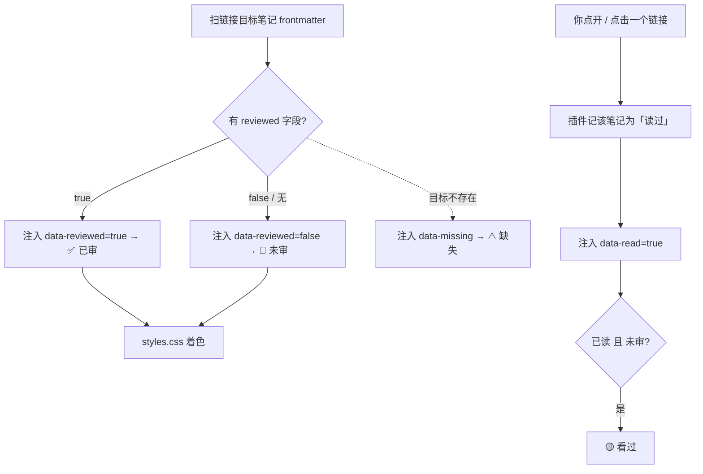

# Click Read Tracker

> Obsidian 点击 / 已读追踪 + 审核状态可视化插件


你用 `reviewed` 字段标记「这篇审过没」。但原生 Obsidian 有个盲区：**没审过的笔记，你到底「点开看过」还是「压根没看过」？** Click Read Tracker 补上这层追踪，并把审核状态直接画在链接和文件栏上。

---

## ✨ 它解决什么

你有一套个人知识管理约定：`reviewed: true` = 审核通过，`reviewed: false` / 无 = 未审。但「未审」里其实混着两种状态：

- **没看过** —— 链接在那，但你从没点进去
- **看过但不通过** —— 你点进去读了，故意没勾 `reviewed`

Obsidian 原生不记录「你点开过哪个笔记」，于是这两者被混为一谈。本插件做的事情很简单：**记住你点开过哪些笔记**，再叠加 `reviewed` 字段，让链接和文件栏变成一张可一眼扫完的审核地图。

## 🎯 功能特性

- **点开即记「读过」**：点内部链接、左栏、快速切换器都算，无需手动标记
- **链接按目标笔记 `reviewed` 着色**：🔴 未审 / ✅ 已审
- **看过但未审标 🟡**：区分「没看 / 看过不通过」两种未审
- **反向链接 / 出链面板同步**：三处视图一致
- **索引 MOC 也能用**：标准 Markdown 链接 `[文本](路径.md)`（常见于「主题速览」「全部条目」表）同样支持；真断链标 ⚠ 缺失
- **绝不写 frontmatter**：只读 `reviewed`，「读过」记录只存插件自己的 `data.json`
- **不依赖 Supercharged Links**：开箱即亮，SL 可卸载

## ⚖️ 为什么不直接用 Supercharged Links

| 维度 | Supercharged Links | Click Read Tracker |
|---|---|---|
| 审核通过标识 | 需配字段 + 规则 | 直接读 `reviewed` |
| 「读过 / 点过」追踪 | 不记录 | **原生记录**（核心差异） |
| 是否写 frontmatter | 可选写入 | **绝不写入**，互不污染 |
| 是否要配置 | 需配 data 属性规则 | **零配置**，开箱即亮 |
| 断链可见 | 需自己配 | 自带 ⚠ 缺失 |

简单说：SL 是「样式引擎」，本插件是「记录引擎 + 零配置样式」。两者可共存，但本插件不依赖它。

## 📦 安装

**方式一：BRAT（推荐，免手动更新）**
1. 安装 [BRAT](https://github.com/TfTHacker/obsidian42-brat) 插件
2. 命令面板 → `BRAT: Add a beta plugin`
3. 粘贴仓库地址：`你的用户名/obsidian-click-read-tracker`
4. 启用 **Click Read Tracker**，重启 Obsidian

**方式二：手动下载**
1. 下载仓库的 `main.js` / `manifest.json` / `styles.css`
2. 放进 `你的库/.obsidian/plugins/click-read-tracker/`
3. 设置 → 社区插件 → 关闭安全模式 → 启用

**方式三：源码**
```bash
git clone https://github.com/你的用户名/obsidian-click-read-tracker.git
# 复制到库的插件目录后启用
```

## 🚀 使用

1. 启用插件（样式 `styles.css` 随插件自动加载，无需手动开 CSS 片段）
2. 照常浏览库：点过的笔记，其链接 / 左栏项会变 🟡「看过」（仅当它尚未审）
3. 命令面板可用：
   - **清除全部「已读」记录** —— 一键重置（不影响 `reviewed`）
   - **调试：重新装饰并打印统计** —— 弹通知显示 `正文链接 N（已解析 M｜缺失 K）｜已审 X / 未审 Y / 看过 Z｜左栏 L`

## 🔒 隐私

「读过」记录只存在插件目录的 `data.json` 里——**不联网、不上传、不含笔记正文**，只记你打开过的笔记路径。卸载插件即删除。

## 🧩 工作原理



## 📁 文件结构

```
click-read-tracker/
├── main.js          # 插件逻辑（追踪 + 属性注入 + 装饰）
├── manifest.json    # 插件清单
├── styles.css       # 状态样式（自动加载）
├── README.md        # 本说明
└── LICENSE          # MIT
```

## 🗒️ 更新日志

- **v1.4.0** — 支持标准 Markdown 链接 `[文本](路径.md)`；真断链标 ⚠ 缺失；命令面板调试统计
- **v1.3.0** — 修复实时预览惰性渲染（视口外链接不标）；多路链接解析（标题 / H1 / 别名 / 大小写）
- **v1.2.0** — 反向链接 / 出链面板同步着色
- **v1.1.0** — 插件自读 `reviewed` 注入 `data-reviewed`，不再依赖 SL 配置
- **v1.0.0** — 初版：点击追踪 + 左栏 / 正文状态

## 🧭 Roadmap

- [ ] 设置面板可调图标 / 颜色
- [ ] 「未审超过 N 天」高亮（积压提醒）
- [ ] 导出审核进度报表

## 📄 License

[MIT](./LICENSE) © AI秘籍
